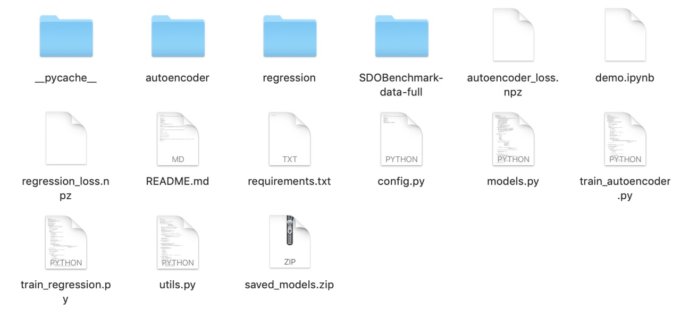

# Autoencoder

This repository is to do convolutional autoencoder with SetNet for solar flux prediction


## Dependencies

- Python 3.5
- PyTorch 1.0.0
- Torchvision 0.2.1
- Sklearn 0.20.2
- PIL 5.4.1
- Panda 0.24.0
- matplotlib 3.0.2

pip install --upgrade fastai torch==1.0.0
pip install torchvision==0.2.1

## Dataset
[Download](https://github.com/i4Ds/SDOBenchmark/archive/data-full.zip) the dataset 
unzip it and put the folder SDOBenchmark-data-full in the project folder


## Architecture


## Usage

### Pre-train Autoencoder

```bash
$ python train_autoencoder.py
```

### Train the Regression Network
```bash
$ python train_regression.py
```

### Demo
Download pre-trained [model](https://www.dropbox.com/s/m7f2tjgnfw11268/saved_models.zip?dl=0) weights into the project folder

then open:

demo.ipynb
### file organization
the files in the project folder should be organized like this:


